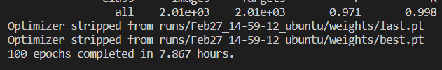
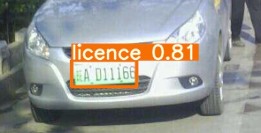
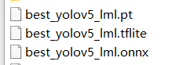
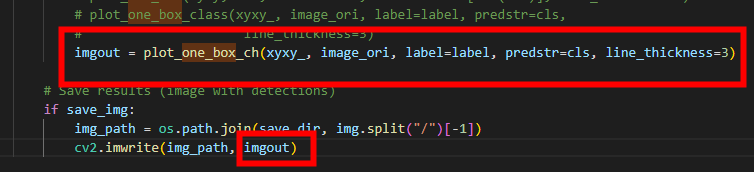
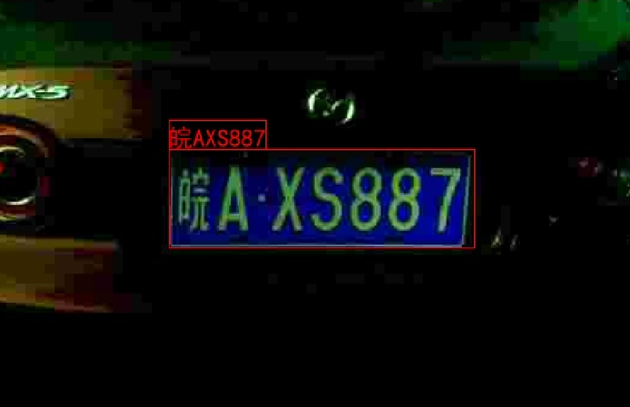
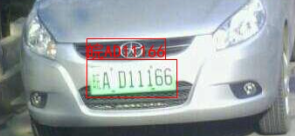

# 车牌识别

**AidLux2023年2月智慧社区AI实战训练营**的车牌识别项目作业展示

项目为车牌识别，针对于智慧社区场景，如停车场出入口等视角较为固定的场景。

项目包含**基于yolov5车牌检测**和**基于LPRNet的车牌识别**两部分。

此文章仅作部分结果的展示，具体的数据处理步骤和训练方式不作阐述。

关注微信公众AidLux，并发送”智慧社区“可获取数据集和本次项目代码。

## 数据集

本次项目使用的数据集为中科大的CCPD数据集，包含CCPD2019和CCPD2020，其中CCPD2019主要为蓝牌（燃油车），CCPD2020为绿牌（电动车）。         

数据集下载方式详见官网链接：https://github.com/detectRecog/CCPD  

数据集中只包含照片，其标注信息全部包含在文件名中。因此需要解析文件名以获取车牌检测和车牌识别的数据集，训练营的大刀老师挑选了10000张图像做了一个小的数据集，方便做demo测试。


## YOLOv5车牌检测

使用cpdd10000数据集，在本机训练了车牌识别模型，



使用export_yolov5.py将best.pt改名为best_yolov5_lml.pt，经过detect_yolov5.py检查后，结果没有问题：



模型转换为onnx模型

在将onnx模型转换为tflite模型时，显示没有安装 TensorFlow Probability，

`ModuleNotFoundError: No module named 'tensorflow_probability'`

查看了[相关页面](https://github.com/tensorflow/probability/releases)，安装了tensorflow-probability 0.16.0版本，之后转换成功，一系列操作后最终得到下面三个模型：



在detect_onnx_pipeline.py测试时，发现自己训练的模型转到onnx模型后，结果出错了，在后面继续用回了老师提供的模型进行演示。


## YOLOv5车牌识别

此处将images_rec分为训练集和验证集进行训练，也出现了训练精度一直为零的情况。

因此后续的测试中还是使用了老师提供的模型。


## PC端算法测试

使用的pc端为windows11系统，显卡为GTX1660Ti。

### ONNX

使用数据集训练出YOLOv5车牌检测模型和LPRNet车牌识别模型，可将模型转换为onnx模型，使用`detect_onnx_pipeline.py` 测试模型效果，可以看到车牌识别的结果，

虽可正确识别车牌，但由于opencv中文字体显示的问题，结果图中没有显示中文，因此使用Pillow来进行中文字体的显示。

在./utils/plots.py中加入下面的函数，再将所需的ttf字体文件放入文件夹中：

```
def plot_one_box_ch(x, img, color=None, label=None, predstr=None, line_thickness=None):
    cv2img = cv2.cvtColor(img, cv2.COLOR_BGR2RGB)
    img_PIL = Image.fromarray(cv2img)
    font = ImageFont.truetype('./simhei.ttf', 20)
    c1, c2 = (int(x[0]), int(x[1])), (int(x[2]), int(x[3]))
    if label:
        if predstr:
            draw = ImageDraw.Draw(img_PIL)
            text_size = draw.textsize(predstr, font)
            draw.text((c1[0], c1[1]-20), predstr, (255, 0, 0), font=font)
            draw.rectangle((c1, c2),outline=(255,0,0))
            draw.rectangle((c1[0], c1[1], c1[0] + text_size[0], c1[1] - text_size[1] - 3),outline=(255,0,0))
            imgout = cv2.cvtColor(np.array(img_PIL), cv2.COLOR_RGB2BGR)
    return imgout
```

在`detect_onnx_pipeline.py`中将`plot_one_box_class`替换成上面的`plot_one_box_ch`，



结果如下：




### TFlite

在使用pc进行`detect_tflite_pipeline.py`进行测试，和前面的onnx测试一样，需要将`plot_one_box_class`替换成上面的`plot_one_box_ch`，具体参照上面的改动，结果如下：




## 安卓端算法测试

安卓端的设备为小米9，安卓版本10，系统为MIUI 12.0.6

