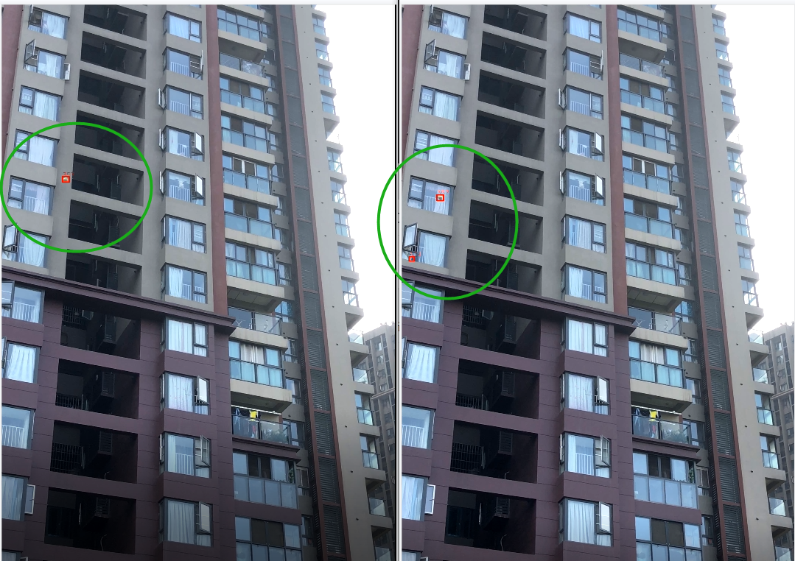
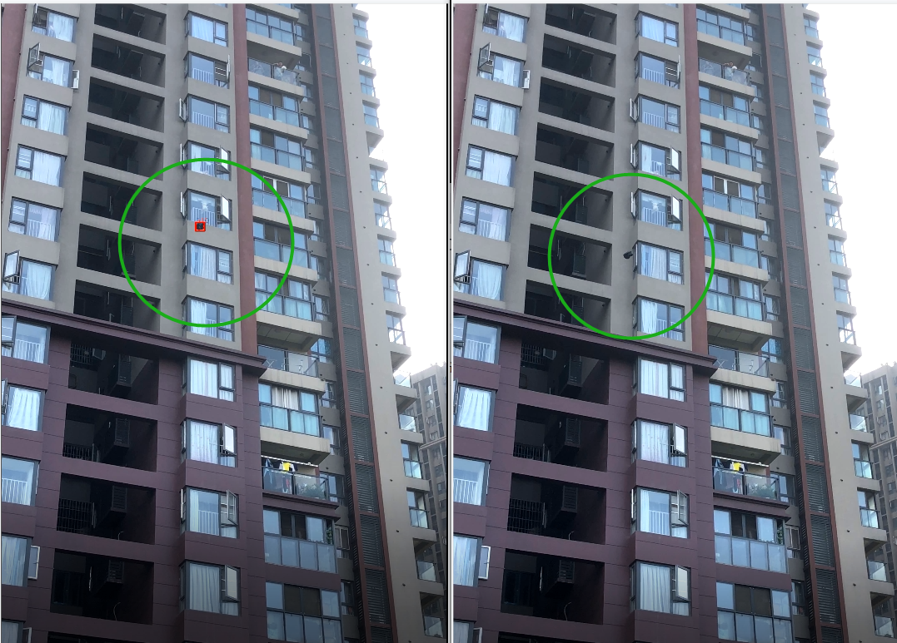

# AidLux实战训练营——高空抛物

2023年2月

## 课程内容

1. 高空抛物场景的背景
2. 高空抛物的方案设计
3. 高空抛物的算法实现
4. PC端以及AidLux的推理测试


## 内容重点

### 算法设计

提出了如下几种方案：

1. 使用传统的动态目标检测，如光流检测和帧差法；
2. 使用目标检测+目标追踪算法，对抛出的物体先做目标检测，并对检测到的物体做追踪；
3. 使用物体追踪+过滤算法；
4. 使用视频分类的算法。

最终选择方法1，使用KNN或MOG2进行背景建模，之后根据帧差，获取动态目标，并使用SORT进行目

标跟踪。

## 算法实现与测试 PC端

pc端代码存放在highthrow_b文件夹中

### 去抖动highthrow_b\adjuster.py

为防止镜头抖动影响背景建模，需要加入去抖动算法

原理是通过每张图的特征，找到两个图片的关键点，并基于关键点获得变换矩阵后，将原图通过变换矩

阵变换后，与第一张原始图片对齐。

### 背景建模highthrow_b\knnDetector.py ：

分别使用了KNN和MOG2的方法进行背景建模，

```
# KNN
self.detector = cv2.createBackgroundSubtractorKNN(history, dist2Threshold, False)
# MOG2
self.detector = cv2.createBackgroundSubtractorMOG2(history, dist2Threshold,False)
```

经过比对，在测试视频中，KNN整体的效果优于MOG，而在用时方面，两个方法差不多。

使用KNN，对光线变化敏感，虽不容易丢失小目标，但会出现误检的情况，在物体掉落的最后阶段，可

能会出现丢失目标的问题；



而使用MOG，在物体掉落的过程中就会出现目标丢失的问题。



### 目标检测与跟踪

#### 目标检测 highthrow_b\knnDetector.py\detectOneFrame

上一步进行背景建模后，可在当前帧图像中去除背景，在对背景进行形态学处理后，可以得到图中需要

跟踪的潜在目标，以及目标的boundingbox

#### 目标跟踪 highthrow_b\sort.py

目标跟踪使用的算法为SORT，是 SIMPLE ONLINE AND REALTIME TRACKING 的简写，其核心算法是

匈牙利算法+卡尔曼滤波，根据目标当前的位置，预测下一帧中目标可能出现的位置。与DeepSort不同

的是，SORT没有使用到目标的特征，而鉴于高空抛物的场景中，一般不会出现重叠目标，SORT便足够.

### 最终效果

见b站视频：https://www.bilibili.com/video/BV15Y41167ra/

## 算法实现与测试 安卓端

在安卓端测试使用的是安卓12，隔没多久就中断，无法链接，没有办法跑程序设计。

跟随官方的指引，或尝试网友的问答贴中方法，均无法解决问题